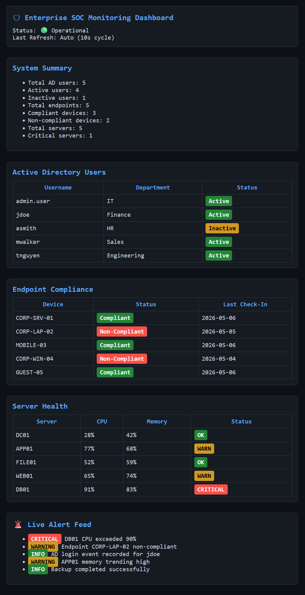

## 🛡 SOC Monitoring Dashboard

This dashboard simulates enterprise SOC monitoring with:
- Active Directory tracking
- Endpoint compliance monitoring
- Server health metrics
- Real-time alert feed

# Enterprise Monitoring Reporting Hub

Enterprise Monitoring Reporting Hub is a production-ready PowerShell monitoring toolkit that aggregates simulated enterprise system data and generates a unified operational report.

## Purpose

This project demonstrates a single pane of glass monitoring system for Windows environments. It brings together Active Directory user lifecycle data, endpoint compliance information, server health metrics, and automation log aggregation into a unified report.

## Single Pane of Glass Concept

A single pane of glass provides centralized visibility across multiple operational domains. In this project, the monitoring hub consolidates identity, endpoint, and server health data into one HTML dashboard and JSON export.

## How Scripts Aggregate Data

- `scripts/Get-ADReport.ps1` simulates Active Directory user lifecycle data.
- `scripts/Get-EndpointReport.ps1` simulates endpoint compliance status.
- `scripts/Get-ServerHealth.ps1` simulates server health metrics and service status.
- `scripts/Invoke-ReportAggregator.ps1` calls each script, combines results, and generates HTML and JSON reports.

## HTML Report Generation

The main aggregator script produces an HTML dashboard with sections for:

- Active Directory Users
- Endpoint Compliance
- Server Health Summary

The dashboard includes color indicators, summary counts, and a timestamp for operational visibility.

## Enterprise Monitoring Simulation

This repository simulates enterprise monitoring by using structured data sources, centralized logging, and a consolidated reporting pipeline. It is built with PowerShell best practices, modular functions, and error handling.

## Future Upgrades

- Real Windows Event Log integration
- Splunk or Elasticsearch integration
- Azure Monitor integration
- Scheduled automation and alerting workflows
